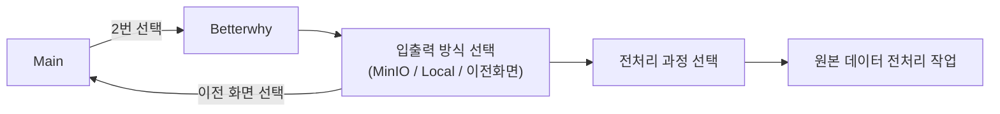

# Betterwhy 데이터 전처리 프로세스



<br>

## 🌐 Betterwhy 로컬 CSV 파일 위치

| 파일명            | 파일 경로 | 
|-------------------|----------------------------------------------------------------------|
| `원본 csv file` <br>pw: evdataset1234!| $ rsync -avhz -e 'ssh -p 9990' --progress --partial data@59.14.241.229:/home/data/hdd_new/betterwhy_data/betterwhy_origin|
| `전처리된 csv file`<br>pw: evdataset1234!| $ rsync -avhz -e 'ssh -p 9990' --progress --partial data@59.14.241.229:/home/data//hdd_new/betterwhy_data/betterwhy_preproc|
| `급속구간 csv file`<br>pw: evdataset1234!| $ rsync -avhz -e 'ssh -p 9990' --progress --partial data@59.14.241.229:/home/data/hdd_new/betterwhy_data/betterwhy_fast_charge|
| `완속구간 csv file`<br>pw: evdataset1234!| $ rsync -avhz -e 'ssh -p 9990' --progress --partial data@59.14.241.229:/home/data/hdd_new/betterwhy_data/betterwhy_slow_charge|
| `방전구간 csv file`<br>pw: evdataset1234!|$ rsync -avhz -e 'ssh -p 9990' --progress --partial data@59.14.241.229:/home/data/hdd_new/betterwhy_data/betterwhy_discharge|
---

<br>

## 🌐 Betterwhy MinIO CSV 파일 위치

| 파일명            | Bucket-Name |파일 경로|
|-------------------|----------------------------------------------------------------------|-|
| `원본 csv file`|keti-ev-data|betterwhy_data/betterwhy_origin|
| `전처리된 csv file`|``|betterwhy_data/betterwhy_preprocessed|
| `급속구간 csv file`|``|betterwhy_data/betterwhy_fast_charge|
| `완속구간 csv file`|``|betterwhy_data/betterwhy_slow_charge|
| `방전구간 csv file`|``|betterwhy_data/betterwhy_discharge|

<br>

## 📌 실행 방법
1️⃣ **[main_info.ini](../../main_info.ini)** : 기본 정보(버킷, 경로 등) 설정

2️⃣ **실행** : 
``` bash
$ bash main.sh
```
  
## 실행 화면
**Input 방식 선택**


**Output 방식 선택**


**전처리 방식 선택**


