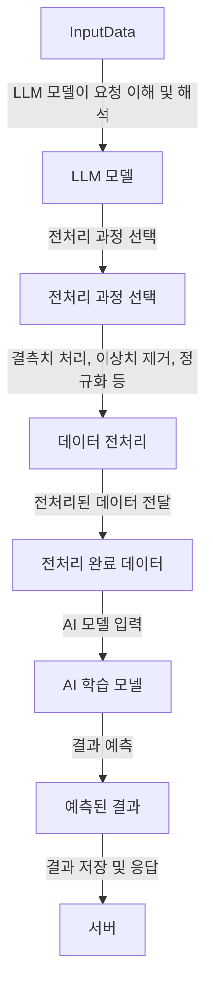

```mermaid
graph TB;
    InputData --> |LLM 모델이 요청 이해 및 해석|LLM[LLM 모델]
    
    LLM --> |전처리 과정 선택|Preproc_Select[전처리 과정 선택]
    
    Preproc_Select --> |결측치 처리, 이상치 제거, 정규화 등|Preprocessing[데이터 전처리]

    Preprocessing --> |전처리된 데이터 전달|ProcessedData[전처리 완료 데이터]
    
    ProcessedData --> |AI 모델 입력|AI_Model[AI 학습 모델]
    
    AI_Model --> |결과 예측|PredictedOutput[예측된 결과]

    PredictedOutput --> |결과 저장 및 응답|Server[서버]
```

### 📌 전처리 로직
- ✅

### 📌 AI 모델
- ✅

### 📌 서버 
- ✅

