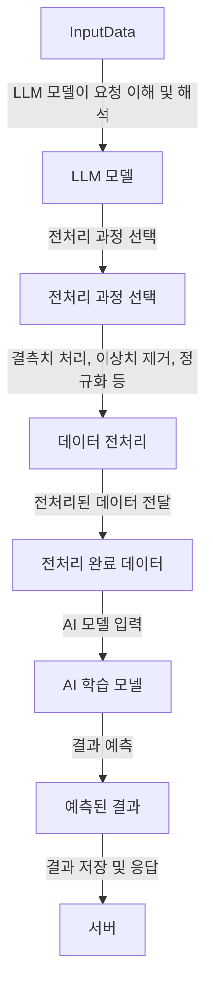

 

# 목표 : 대화로 ChatGPT 처럼 전처리 가능하도록 

### 📌 전처리 로직
- 데이터 수집 및 로드: CSV, JSON, 또는 기타 데이터 파일을 시스템으로 불러옴

- ⭐ 결측치, 이상치 처리: 결측값(NaN)을 확인하고, 적절한 방법(삭제, 대체 등)으로 처리합니다.

    - 예: 평균값, 중앙값으로 대체하거나, 행/열 삭제 
    - 예: IQR(Interquartile Range)을 활용한 이상치 제거

- 형식 변환 및 정규화: 특정 컬럼의 데이터를 원하는 형식으로 변환하고, 스케일링 또는 정규화를 적용합니다.

    - 예: EV 분석용 데이터 규격에 맞게 데이터 정규화

- ⭐ 피처 엔지니어링: 모델에 필요한 새로운 피처(변수)를 생성하거나, 기존 피처를 변형하여 모델 성능을 향상시킬 수 있는 데이터를 만듬

    - 예: 시간 기반의 피처 생성, 차분(차이) 계산 등

- 데이터 저장: 전처리된 데이터를 적절한 포맷으로 저장하여 모델 학습이나 예측에 사용할 수 있게 합니다.

 

### 📌 AI 모델
- LLM + 계산 AI 모델
- LangChain으로 LLM 학습

### 📌 서버
- 

 

## ⭐ 센터장님 말씀
- 1️⃣ 서버에 AI모델 학습시킨 정보를 어떻게 공유하고 관리할지 (GPU 서버 등) 
- 2️⃣ 새로운 분석 찾기 
