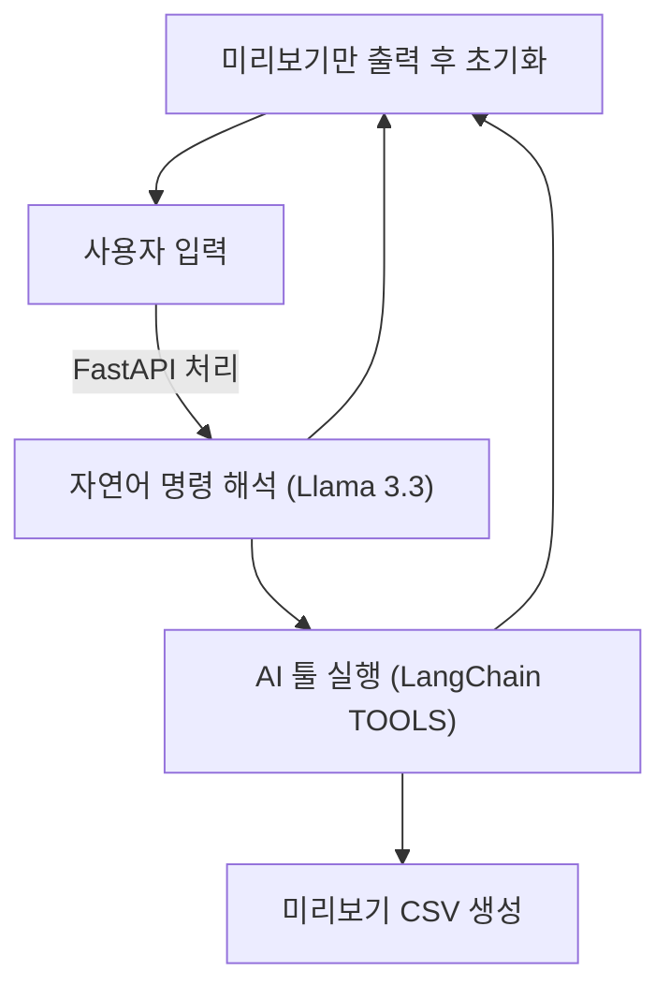

```mermaid
graph TD

A1["Open WebUI"] --> A2["사용자 입력"]
A2 -->|FastAPI 처리| C1["자연어 명령 해석 (Llama 3.3)"]
C1 --> C2["AI 툴 실행 (LangChain TOOLS)"]
C1 --> A1["툴 선택 실패 시 초기화"]
C2 --> C3["미리보기 CSV 생성"]
C2 --> A1["미리보기만 출력 후 초기화"]
```
