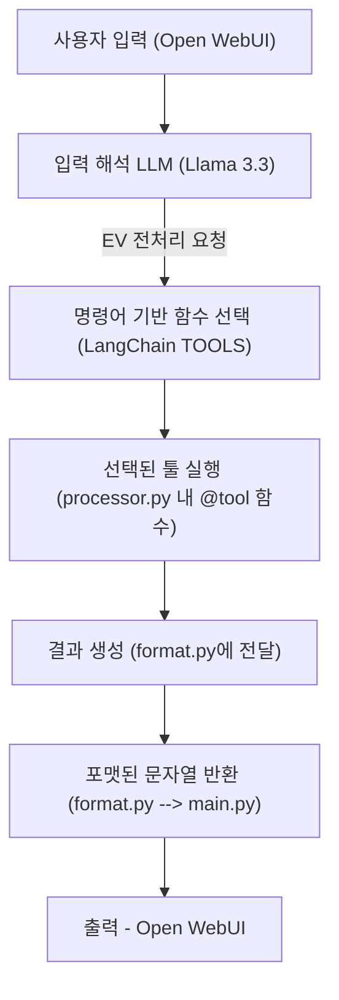

```mermaid
graph TD

A1["사용자 입력 (Open WebUI)"] --> A2["입력 해석 LLM (Llama 3.3)"]

%% 🚧 [확장 예정] 일반 챗 요청일 경우
%% A2 -->|일반 챗 요청| B1["일반 챗 LLM (예: GPT 호출)"]
%% B1 --> B2["자연어 응답 생성"]
%% B2 --> B3["출력 - Open WebUI (StreamingResponse)"]

A2 -->|EV 전처리 요청| C1["명령어 기반 함수 선택 (LangChain TOOLS)"]
C1 --> C2["선택된 툴 실행 (processor.py 내 @tool 함수)"]
C2 --> C3["결과 생성 (format.py에 전달)"]
C3 --> C4["포맷된 문자열 반환 (format.py --> main.py)"]
C4 --> C5["출력 - Open WebUI"]


```
