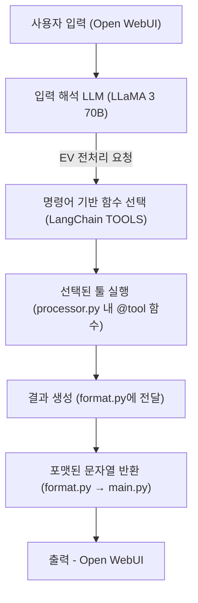

# 📘 전기차 및 반도체 데이터 전처리 LLM 프로젝트



---

## 🧾 프로젝트 소개

이 프로젝트는 **전기차 및 반도체 분야의 센서 및 시계열 데이터**를 자동으로 전처리하고,  
**대형 언어 모델 (LLM)**을 활용하여 자연어 기반의 **질의응답 및 데이터 분석 기능**을 제공하는 백엔드 시스템입니다.

사용자는 **Open-WebUI 기반 인터페이스**를 통해 데이터를 손쉽게 업로드하고,  
자연어로 질문하여 복잡한 전처리 결과를 직관적으로 확인할 수 있습니다.

또한, 다양한 데이터 소스와의 연동이 가능하며,  
**유연한 함수 매핑 구조**를 통해 전처리 로직을 손쉽게 확장할 수 있도록 설계되어 있습니다.

---

## 🔍 주요 기능

- ⚙️ **전기차 및 반도체 데이터 자동 전처리 파이프라인**
- 🔁 **사용자 요청 기반 유연한 함수 매핑 및 실행 구조**
- 🤖 **LLM 연동을 통한 자연어 기반 질의응답**

---

## 📂 디렉토리 구조

```
KETI_LLM/
├── backend/                         
│   ├── api/    
│   │   ├── dockerfile                # FastAPI docker 설정
│   │   ├── requirements.txt          # 프로젝트 의존 패키지 목록                      
│   │   └── main.py                   # FastAPI 엔트리포인트
│   ├── config/                       
│   │   ├── aicar_cartype_list.csv   
│   │   ├── betterwhy_cartype_list.csv   
│   │   ├── ev_keywords.json             
│   │   └── path_info.ini                
│   ├── core/                         
│   │   ├── format.py                 
│   │   ├── processor.py              # LLM 기반 함수 실행
│   │   └── llama.py                  # LLM 처리 모듈
│   ├── data/                         
│   │   ├── ev_preprocessing.py       
│   │   ├── semicon_preprocessing.py  
│   │   └── MinioData.py        
├── open-webui/                      
└── README.md                         
```

---

## 🖥️ 서버 사양

- **서버 위치** : 시흥 GPU2 서버 `keti-ev1.iptime.org -p 2005`
- **CPU** : Ryzen 7960x (24C 48T)
- **RAM** : 128GB
- **NVMe** : 1TB
- **GPU** :
  - RTX 4090 (24GB)
  - RTX 3080 (10GB)
- **전력** : 2000W PSU

---

## 🧠 LLM 모델

- **모델** : LLaMA 3 (70B)
- **VRAM 사용량** : GPU 2장 합산 시 약 85~90% 사용

---

## ⚙️ 실행 방법

### 🔹 Open-WebUI 접속

- URL : http://keti-ev1.iptime.org:3333/
- Email : `keti@keti.re.kr`
- PW : `keti1234!`

---

## 💬 예시 명령어 (잘 작동하는 입력)

### 🚗 전기차

- **원본 데이터 전처리**
  - `배터와이 원본데이터 처리해줘`
  - `Betterwhy 원본데이터 정리해줘`

- **충전/방전 구간 분류**
  - `완속 구간 분류해줘`
  - `급속 구간 분류해줘`
  - `방전 구간 분류해줘`

- **구간별 통계 추출**
  - `구간데이터 통계 추출해줘`
  - `데이터 통계 처리해줘`

### 🏭 반도체

- **원본데이터 분류**
  - `반도체 원본데이터 분류해줘`
  - `반도체 파일 나눠줘`

- **날짜 기준 그룹화**
  - `반도체 데이터를 일 단위로 그룹화해줘`
  - `반도체 데이터 월별로 묶어줘`
  - ℹ️ 일/월 키워드 없으면 **기본: 월별 처리**

- **STEP 기준 분리**
  - `반도체 데이터를 STEP별로 분리해줘`
  - `B.UP 단계만 따로 분리해줘`
  - ℹ️ Step 이름 없으면 전체(All) 처리

- **STEP 기준 그룹화**
  - `STEP 기준으로 그룹화해줘`
  - `B.UP STEP 기준으로 그룹화해줘`

---

## ✅ Tip

- 자연어로 자유롭게 입력해도 되지만,  
  **핵심 키워드(예: 원본데이터, 구간 분류, Step, 그룹화)**가 포함되면 정확도가 높아집니다.

---

## 📈 전처리 결과 예시


---

## 📝 작업 예정

- 전처리 모듈 기능 추가 및 성능 보완
