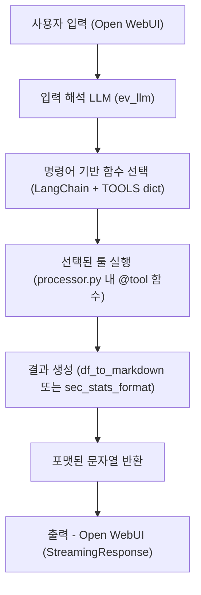

```mermaid
graph TD

A1["사용자 입력 (Open WebUI)"] --> A2["입력 해석 LLM (ev_llm)"]
A2 --> A3["명령어 기반 함수 선택 (LangChain + TOOLS dict)"]
A3 --> A4["선택된 툴 실행 (processor.py 내 @tool 함수)"]
A4 --> A5["결과 생성 (df_to_markdown 또는 sec_stats_format)"]
A5 --> A6["포맷된 문자열 반환"]
A6 --> A7["출력 - Open WebUI (StreamingResponse)"]

```
