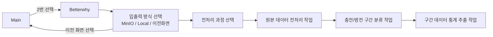

## 작업 상태
- ❌ 작업 1: 진행 중
- 🔄 작업 2: 진행 중
- ✅ 작업 3: 완료

## 📝 진행 예정
1. 🔄 충/방전 코드 SK/배터와이/아이카 통합 스크립트 만들기

2. ❌ 구간 데이터 통계 코드 SK/배터와이/아이카 통합 스크립트 만들기

3. ❌ 폴더 정리

4. ❌ CSV 파일에 전처리 단계 확인용 필드 추가 (ex. `EV_SK_1`, `SEMICON_**_1`

5. ❌ 경로 설정 함수 만들기

6. ❌ README 작성 
