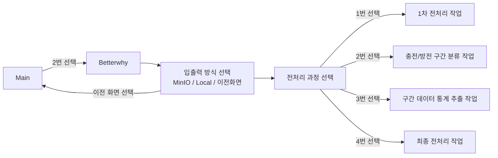

# Betterwhy 데이터 전처리 프로세스



## Betterwhy 로컬 CSV 파일 위치

| 파일명            | 파일 경로 | 
|-------------------|----------------------------------------------------------------------|
| `원본 csv file` <br>pw: evdataset1234!| $ rsync -avhz -e 'ssh -p 9990' --progress --partial data@59.14.241.229:/home/data/hdd_new/betterwhy_data/betterwhy_origin|
| `전처리된 csv file`<br>pw: evdataset1234!| $ rsync -avhz -e 'ssh -p 9990' --progress --partial data@59.14.241.229:/home/data//hdd_new/betterwhy_data/betterwhy_preproc|
| `급속구간 csv file`<br>pw: evdataset1234!| $ rsync -avhz -e 'ssh -p 9990' --progress --partial data@59.14.241.229:/home/data/hdd_new/betterwhy_data/betterwhy_fast_charge|
| `완속구간 csv file`<br>pw: evdataset1234!| $ rsync -avhz -e 'ssh -p 9990' --progress --partial data@59.14.241.229:/home/data/hdd_new/betterwhy_data/betterwhy_slow_charge|
| `방전구간 csv file`<br>pw: evdataset1234!|$ rsync -avhz -e 'ssh -p 9990' --progress --partial data@59.14.241.229:/home/data/hdd_new/betterwhy_data/betterwhy_discharge|
---

## Betterwhy MinIO CSV 파일 위치

| 파일명            | Bucket-Name |파일 경로|
|-------------------|----------------------------------------------------------------------|-|
| `원본 csv file`|keti-ev-data|betterwhy_data/betterwhy_origin　　　　　　　　　　　　　　　　　　　　　　|
| `전처리된 csv file`|``|betterwhy_data/betterwhy_preprocessed|
| `급속구간 csv file`|``|betterwhy_data/betterwhy_fast_charge|
| `완속구간 csv file`|``|betterwhy_data/betterwhy_slow_charge|
| `방전구간 csv file`|``|betterwhy_data/betterwhy_discharge|

## 실행 방법
- #### **[main_info.ini](../../main_info.ini)** : 기본 정보(버킷, 경로 등) 설정
- #### **[main.sh](../../main.sh)** : main.sh 실행

## 실행 화면
**Input 방식 선택**
```python
===================================================
***********  Input 방식을 선택해주세요. ***********
===================================================
1. MinIO
2. Local
3. 이전 화면
---------------------------------------------------
실행할 input방식을 입력해주세요: 1
```
**Output 방식 선택**
```python
===================================================
***********  Output 방식을 선택해주세요. ***********
===================================================
1. MinIO
2. Local
3. 이전 화면
---------------------------------------------------
실행할 output방식을 입력해주세요: 2
```
**전처리 방식 선택**
```python
====================================================
*****************  Betterwhy-DATA  *****************
====================================================
1. 1차 전처리 작업(preproc)
2. 충전구간 분류 작업(classify_precess)
3. 구간 통계 작업(section_statistic)
4. 최종 전처리 작업(final_preproc)
5. 이전 화면
----------------------------------------------------
**** input 방식 : MinIO || output 방식 : Local ****
----------------------------------------------------
실행할 데이터 번호를 입력해주세요: 1
```
