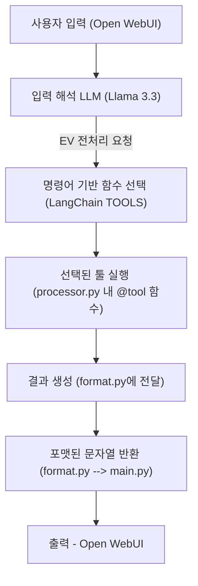

# 📘 데이터 전처리 LLM Aegnet

<br>



## 🧾 프로젝트 소개

이 프로젝트는 **전기차 및 반도체 분야의 센서 및 시계열 데이터**를 자동으로 전처리하고,  
**대형 언어 모델** (LLM, Large Language Model)을 통해 자연어 기반의 **질의응답 및 데이터 분석 기능**을 제공하는 백엔드 시스템입니다.

사용자는 **Open-WebUI 기반의 인터페이스**를 통해 데이터를 쉽게 업로드하고,  
**자연어로 질문**하여 복잡한 분석 결과를 **직관적으로 확인**할 수 있습니다.

또한, 다양한 데이터 소스와의 연동이 가능하며,  
**유연한 함수 매핑 구조**를 통해 전처리 로직을 손쉽게 확장할 수 있도록 설계되어 있습니다.

<br>

## 🔍 주요 기능

- ⚙️ **전기차 및 반도체 데이터 자동 전처리 파이프라인**
- 🔁 **사용자 요청 기반 유연한 함수 매핑 및 실행 구조**
- 🤖 **LLM 연동을 통한 자연어 기반 질의응답**

<br>

## 📂 디렉토리 구조 
```
KETI_LLM/
├── backend/                         
│   ├── api/    
│   │   ├── dockerfile                # FastAPI docker 설정
│   │   ├── requirements.txt          # 프로젝트 의존 패키지 목록                      
│   │   └── main.py                   # FastAPI 등 메인 엔트리포인트
│
│   ├── config/                       # 설정 파일 및 매핑 정보
│   │   ├── aicar_cartype_list.csv   
│   │   ├── betterwhy_cartype_list.csv   
│   │   ├── ev_keywords.json             
│   │   └── path_info.ini                
│
│   ├── core/                         # 핵심 로직 및 처리 모듈
│   │   ├── format.py                 
│   │   ├── processor.py              # LLM 지시 기반 함수 실행 모듈
│   │   └── llama.py                  # LLM 관련 처리 모듈
│
│   ├── data/                         # 데이터 처리 관련 모듈
│   │   ├── ev_preprocessing.py       # 전기차 전처리 모듈
│   │   ├── semicon_preprocessing.py  # 반도체 전처리 모듈 
│   │   └── MinioData.py        
│
├── open-webui/                       # Open-WebUI 폴더
└── README.md                         
```

<br>


## 🖥️ 서버 사양 
- **서버 위치** : **keti-gpuserver2,** `keti-ev1.iptime.org -p 2005`
- **CPU** : Ryzen 7960x (24C 48T)
- **RAM** : 128GB
- **NVMe** : 1TB
- **GPU** :
  - RTX 4090 (24GB)
  - RTX 3080 (10GB)
- **전력** : 2000W PSU

---
## 🧠 LLM 모델 
 - **모델** : Llama 3.3 70B (42GB) 
 - **VRAM 사용량** : `85 ~ 90%` 사용

---
## ⚙️ 실행 방법
- ### ⭐ Open-WebUI 접속
    - URL : http://keti-ev1.iptime.org:3333/
    - Email : `keti@keti.re.kr`
    - PW : `keti1234!`

---

- ### ⭐ 답변 잘 나오는 입력 값 :
  - `🚗 전기차`
    - **원본데이터 전처리**
        - `"Betterwhy 원본데이터 정리해줘` or `배터와이 원본데이터 처리해줘"`
        - `"Aicar 원본데이터 정리해줘` or `아이카 원본데이터 처리해줘"`
    - **완속/급속/방전 구간 분류**
        - `"완속 구간 분류해줘"`
        - `"급속 구간 분류해줘"`
        - `"방전 구간 분류해줘"`

    - **구간 데이터 통계 추출**
        - `"구간데이터 통계 추출해줘"`
        - `"데이터 통계 처리해줘"`


  - `🏭 반도체`
    - **원본데이터 분류**
        - `"반도체 원본데이터 분류해줘"`
        - `"반도체 파일 나눠줘"`

    - **날짜 기준 그룹화**
        - `"반도체 데이터를 일 단위로 그룹화해줘"`
        - `"반도체 데이터 월별로 묶어줘"`

    > ℹ️ 사용자 입력에 `일`, `월`, `day`, `month`가 없으면 기본은 **'월별(month)' 처리**

    - **STEP 기준 분리**
        - `"반도체 데이터를 STEP별로 분리해줘"`
        - `"B.UP 단계만 따로 분리해줘"`

    > ℹ️ 사용자 입력에 Step 이름(B.UP, B.FILL 등)이 없으면 **전체(All) 처리**

    - **STEP 기준 그룹화**
        - `"반도체 데이터를 STEP 기준으로 그룹화해줘"`
        - `"반도체 데이터를 B.UP STEP 기준으로 그룹화해줘"`

---

## ✅ Tip

- 자연어로 편하게 말해도 작동하지만, 위 예시처럼 **핵심 단어(원본데이터, 구간 분류, Step, 그룹화 등)** 가 포함되면 정확도가 높음
    
    
<br>

## 📈 전처리 결과 예시


<br>

## 📝 작업 예정
- #### 전처리 모듈 기능 추가 및 성능 보완
