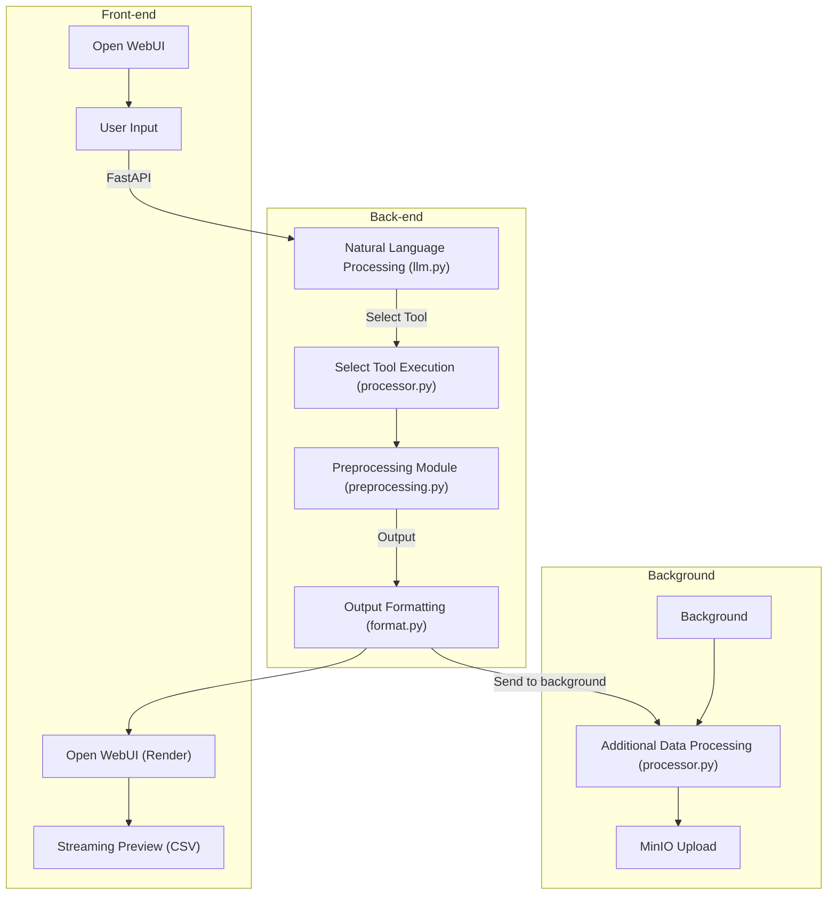

```mermaid
flowchart TD

%% Front-end 영역
subgraph FE [Front-end]
    A1["Open WebUI"]
    A2["User Input"]
    A3["Open WebUI (Render)"]
    A4["Streaming Preview (CSV)"]
end

%% Back-end 영역
subgraph BE [Back-end]
    B1["Natural Language Processing (llm.py)"]
    B2["Select Tool Execution (processor.py)"]
    B3["Preprocessing Module (preprocessing.py)"]
    B4["Output Formatting (format.py)"]
end

%% Background 영역
subgraph BG [Background]
    C1["Background"]
    C2["Additional Data Processing (processor.py)"]
    C3["MinIO Upload"]
end

%% 흐름 연결
A1 --> A2
A2 -->|FastAPI| B1
B1 -->|Select Tool| B2
B2 --> B3
B3 -->|Output| B4
B4 --> A3
A3 --> A4
B4 -->|Send to background| C2
C1 --> C2 --> C3
```
:contentReference[oaicite:45]{index=45}

