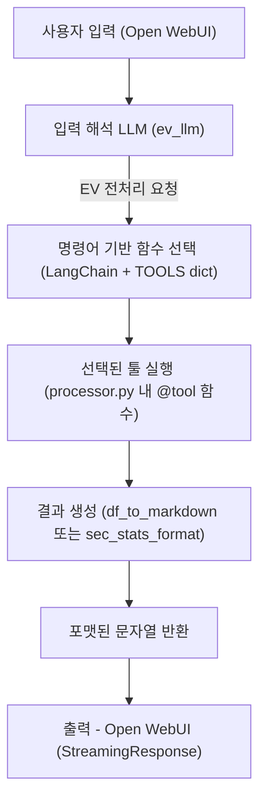

# 📘 전기차 데이터 전처리 LLM 프로젝트

<br>



## 🧾 프로젝트 소개
#### 전기차에서 수집된 다양한 데이터를 자동으로 전처리하고, 이를 LLM(Large Language Model)을 활용해 질의응답 및 분석에 활용할 수 있도록 구성된 백엔드 시스템 
#### 사용자 요청에 따라 데이터를 처리하며, Open-WebUI 기반의 인터페이스를 통해 자연어로 손쉽게 결과를 확인할 수 있도록 설계되어있음 
#### 또한, 이 시스템은 다양한 데이터 소스와의 연동이 가능하며, 유연한 함수 매핑 구조를 통해 전처리 로직을 손쉽게 확장 가능

<br>

- ### 🔍 주요 기능

    - #### 전기차 데이터에 대한 자동 전처리 파이프라인

    - #### 사용자 요청 기반의 유연한 함수 매핑 및 처리

    - #### LLM 연동을 통한 자연어 기반 질의 응답

<br>

## 📂 디렉토리 구조 
```
KETI_LLM/
├── backend/                         
│   ├── api/    
│   │   ├── dockerfile                # FastAPI docker 설정
│   │   ├── requirements.txt          # 프로젝트 의존 패키지 목록                      
│   │   └── main.py                   # FastAPI 등 메인 엔트리포인트
│
│   ├── config/                       # 설정 파일 및 매핑 정보
│   │   ├── betterwhy_cartype_list.csv   
│   │   ├── ev_keywords.json             
│   │   └── path_info.ini                
│
│   ├── core/                         # 핵심 로직 및 처리 모듈
│   │   ├── format.py                 
│   │   ├── processor.py              # LLM 지시 기반 함수 실행 모듈
│   │   └── llama.py                  # LLM 관련 처리 모듈
│
│   ├── data/                         # 데이터 처리 관련 모듈
│   │   ├── ev_preprocessing.py       # 전기차 전처리 모듈
│   │   └── MinioData.py              
│
├── open-webui/                       # Open-WebUI 폴더
└── README.md                         
```

<br>


## 🖥️ 서버 사양 
 - #### 시흥 GPU2 서버 : `keti-ev1.iptime.org -p 2005`
    - #### `CPU` : Ryzen7960x (24C 48T)
    - #### `RAM` : 128GB
    - #### `NVMe` : 1TB
    - #### `PSU` : 2000W
    - #### `GPU` 
        - #### RTX 4090 (24GB)
        - #### RTX 3080 (10GB)

<br>

## 🧠 LLM 모델 
 - #### LLM Model : `Llama 3.3 : 70B` (42GB) 
 - #### LLM Model 실행 할 경우 GPU 2장 모두 메모리 `85 ~ 90%` 사용

<br>

## ⚙️ 실행 방법
- ### ⭐ Open-WebUI 접속
    - #### `URL` : http://keti-ev1.iptime.org:3333/
    - #### `Email` : keti@keti.re.kr
    - #### `PW` : keti1234!

- ### ⭐ 답변 잘 나오는 입력 값 :
    - #### 원본데이터 처리 (배터와이만 가능) : Betterwhy 원본데이터 처리해줘 or 배터와이 원본데이터 처리해줘
    - #### 완속, 급속, 방전 구간 분류 : OO구간 분류해줘
    - #### 구간데이터 통계 추출 : 구간데이터 통계 추출해줘 or 데이터 통계 처리해줘
    
    
<br>

## 📈 전처리 결과 예시


<br>

 ## 📝 작업 예정
- #### 🔜 Open-WebUI 함수기능 추가
- #### 전처리 모듈 추가 및 수정
