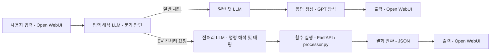

```mermaid
graph LR

A1[사용자 입력 - Open WebUI] --> A2[입력 해석 LLM - 분기 판단]

A2 -->|일반 채팅| B1[일반 챗 LLM]
B1 --> B2[응답 생성 - GPT 방식]
B2 --> B3[출력 - Open WebUI]

A2 -->|EV 전처리 요청| C1[전처리 LLM - 명령 해석 및 매핑]
C1 --> C2[함수 실행 - FastAPI / processor.py]
C2 --> C3[결과 반환 - JSON]
C3 --> C4[출력 - Open WebUI]

```

