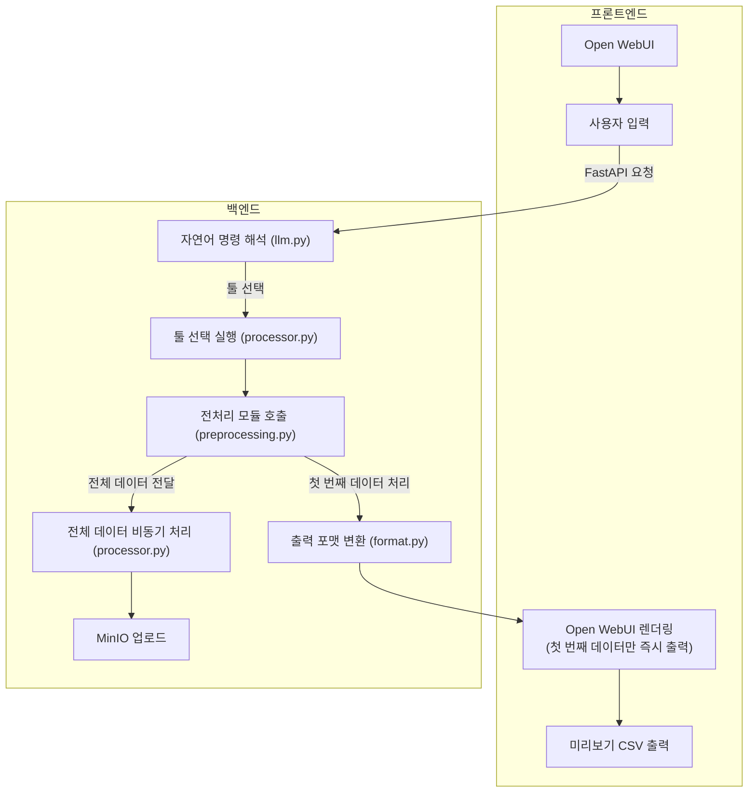

```mermaid
flowchart TD

%% 프론트엔드 영역
subgraph FE [프론트엔드]
    A1["Open WebUI"]
    A2["사용자 입력"]
    A3["Open WebUI 렌더링<br>(첫 번째 데이터만 즉시 출력)"]
    A4["미리보기 CSV 출력"]
end

%% 백엔드 영역
subgraph BE [백엔드]
    B1["자연어 명령 해석 (llm.py)"]
    B2["툴 선택 실행 (processor.py)"]
    B3["전처리 모듈 호출 (preprocessing.py)"]
    B4["출력 포맷 변환 (format.py)"]
    B5["전체 데이터 비동기 처리 (processor.py)"]
    B6["MinIO 업로드"]
end

%% 흐름 연결
A1 --> A2
A2 -->|FastAPI 요청| B1
B1 -->|툴 선택| B2
B2 --> B3
B3 -->|첫 번째 데이터 처리| B4
B4 --> A3
A3 --> A4

B3 -->|전체 데이터 전달| B5
B5 --> B6
```
