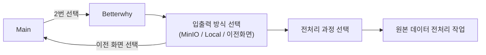

```mermaid
  graph LR;
  
  A1[사용자 입력 (Open WebUI)] --> A2[LLM이 입력 해석]
  
  A2 -->|일반 채팅| B1[응답 생성 (GPT 방식)]
  B1 --> B2[Open WebUI에 출력]
  
  A2 -->|EV 전처리 요청| C1[전처리 LLM에게 명령 전달]
  C1 --> C2[명령 재해석 및 함수 매핑]
  C2 --> C3[전처리 함수 실행 (FastAPI / processor.py)]
  C3 --> C4[전처리 결과 반환 (JSON)]
  C4 --> C5[Open WebUI에 출력]
```



