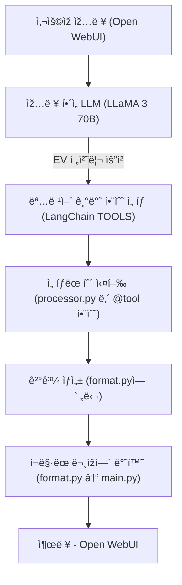

# 📘 전기차 ë° ë°˜ë„ì²´ ë°ì´í„° 전처리 LLM 프로ì íŠ¸

```mermaid
graph TD

A1["ì‚¬ìš©ìž ìž…ë ¥ (Open WebUI)"] --> A2["ìž…ë ¥ í•´ì„ LLM (LLaMA 3 70B)"]
A2 -->|EV 전처리 요청| C1["명령어 기반 함수 ì„ íƒ (LangChain TOOLS)"]
C1 --> C2["ì„ íƒëœ 툴 실행 (processor.py ë‚´ @tool 함수)"]
C2 --> C3["ê²°ê³¼ ìƒì„± (format.pyì— ì „ë‹¬)"]
C3 --> C4["í¬ë§·ëœ 문ìžì—´ 반환 (format.py → main.py)"]
C4 --> C5["출력 - Open WebUI"]
```
